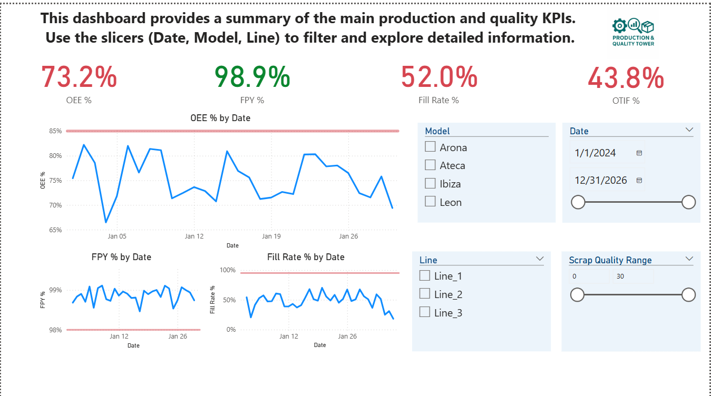
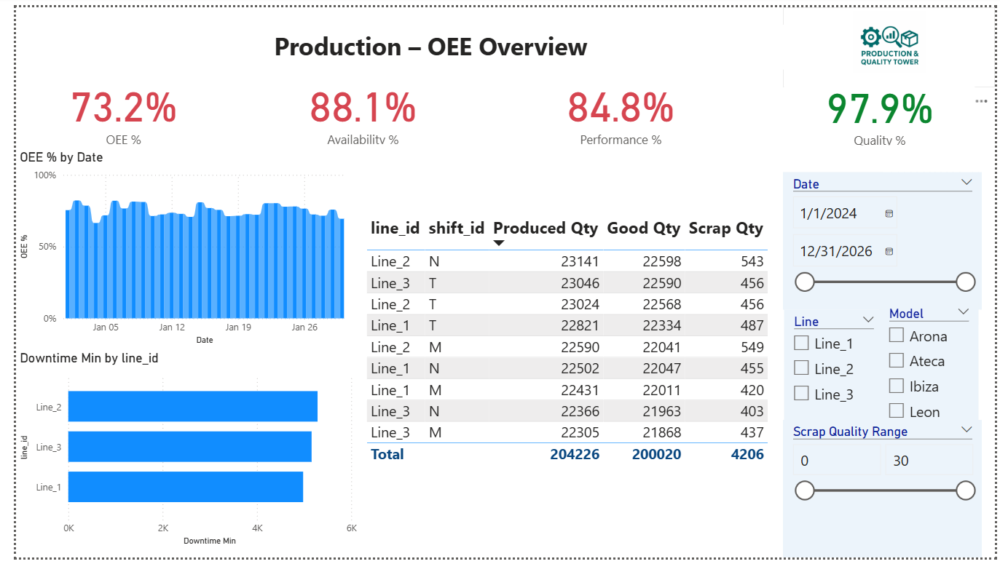
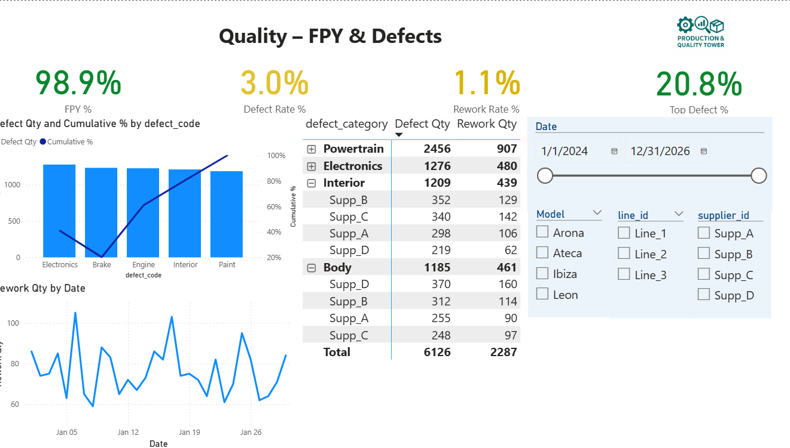
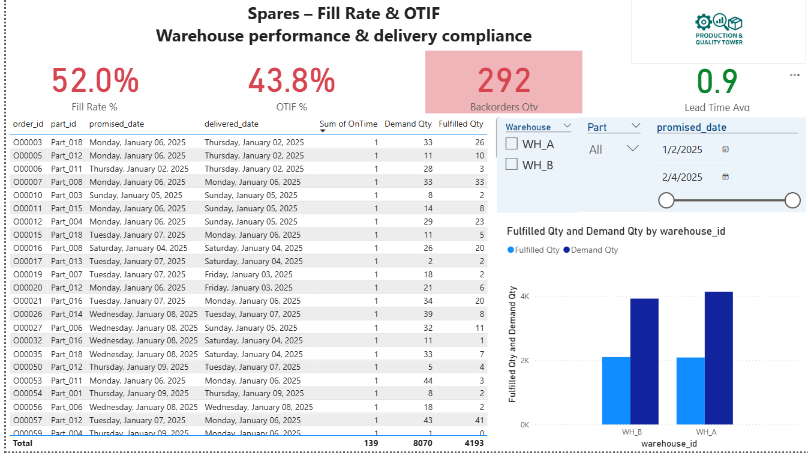

# Auto Factory – Production & Quality Control Tower (Power BI + Power Automate)

**Goal.** An end-to-end industrial dashboard for an automotive plant (Martorell-like) covering Production OEE, Quality FPY & Pareto, and Spares logistics (Fill Rate & OTIF).  
**Deliverables.** Power BI report (`pbix/AutoFactory_ControlTower.pbix`), daily PDF export (`exports/car_factory.pdf`), and data samples (`/data`).

---

## 1) Data Inputs

- `production_shifts.csv`: per-shift production KPIs (date, shift_id, line_id, model_id, produced_qty, good_qty, scrap_qty, downtime_min, planned_time_min, ideal_cycle_sec).  
- `quality_defects.csv`: defects & rework (defect_date, model_id, line_id, defect_code, defect_category, supplier_id, defect_qty, rework_qty).  
- `spares_orders.csv`: spares demand & fulfillment (order_id, part_id, warehouse_id, demand_qty, fulfilled_qty, promised_date, delivered_date).  
**Date format:** `YYYY-MM-DD`.

---

## 2) Data Model

Star-schema with shared dimensions:
- **Fact tables:** `Production_Shifts`, `Quality_Defects`, `Spares_Orders`.
- **Dimensions:** `Dim_Model (model_id)`, `Dim_Date (Date)`.

**Relationships:**  
- `Production_Shifts[model_id]` → `Dim_Model[model_id]` (M:1, single)  
- `Quality_Defects[model_id]` → `Dim_Model[model_id]` (M:1, single)  
- Dates from facts → `Dim_Date[Date]` (M:1, single)  

_No direct relationship between `Production_Shifts` and `Quality_Defects` to avoid ambiguity._

---

## 3) Core Measures (DAX)

- OEE % = Availability × Performance × Quality  
- FPY % = Good Qty / (Good Qty + Rework Qty)  
- Fill Rate % = Fulfilled Qty / Demand Qty  
- OTIF % = On-time deliveries / All deliveries  

(See full list of measures in `/pbix` file.)

---

## 4) Report Pages

### Landing Page
KPIs (OEE, FPY, Fill Rate, OTIF) + Slicers + OEE trend  

### Production – OEE
OEE trend, Downtime by line, Production table  

### Quality – FPY & Defects
FPY %, Pareto by defect_code, Defect matrix  

### Spares – Fill Rate & OTIF
KPIs, Demand vs Fulfilled by warehouse, orders table  

---

## 5) RLS (Row-Level Security)

- **Production_Role:** restrict to `line_id` IN {"Line_1","Line_2"}  
- **Quality_Role:** restrict by `model_id` if needed  
- **Spares_Role:** restrict to a specific `warehouse_id`

---

## 6) Power Automate Flows (documented design)

> Requires Power BI Service.  
- **Daily PDF Email (08:00):** Refresh dataset → Export Landing → Send email.  
- **Alerts:** If OEE < 85% or Fill Rate < 95% (critical part stockout) → notify via Email/Teams.

---

## 7) How to Run

1. Clone repo and open `pbix/AutoFactory_ControlTower.pbix`.  
2. Update data source paths if prompted (`/data`).  
3. Refresh and explore dashboards.  
4. Export PDF if needed (`exports/`).  

---

## 8) Why this project

- Industrial KPIs (OEE, FPY, Fill Rate, OTIF) with reusable star schema and clean DAX.  
- Secure sharing via RLS.  
- Automation-ready design for reporting and alerts.

---
